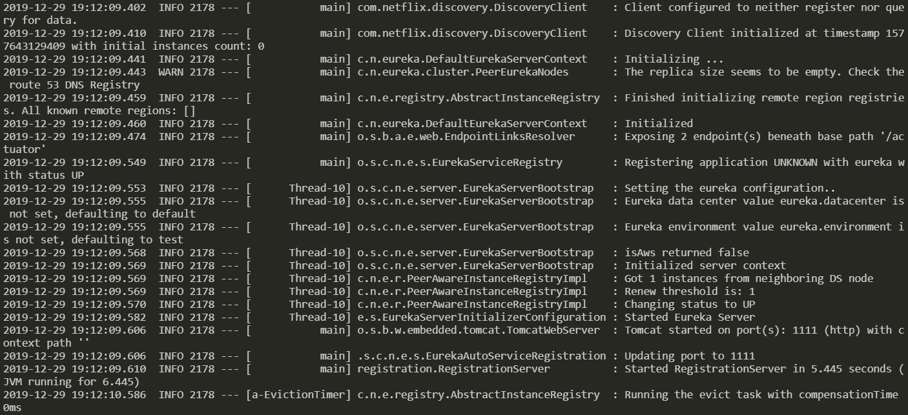
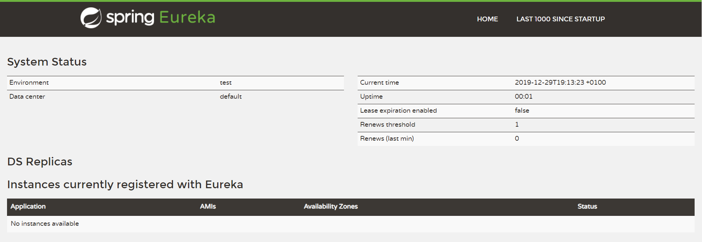
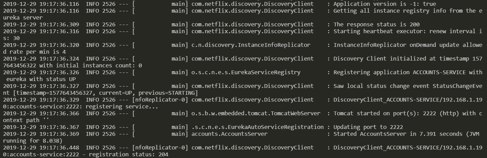
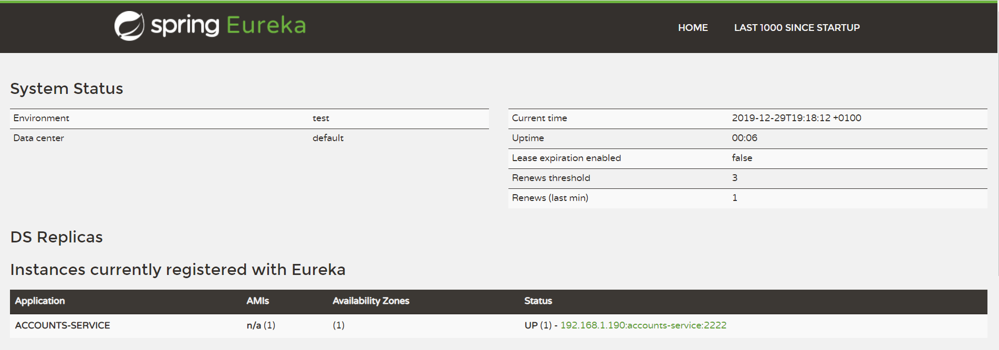
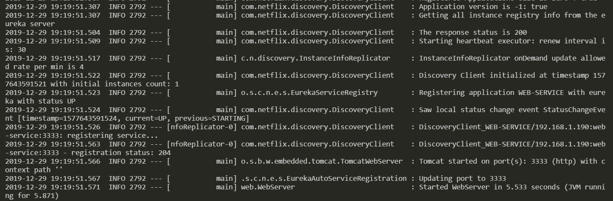
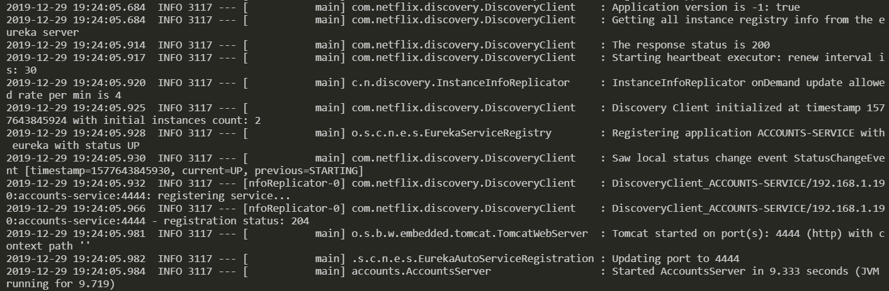
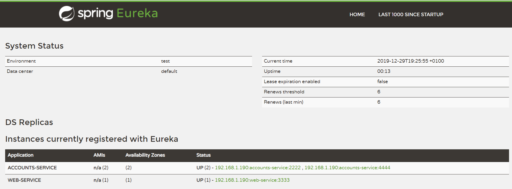
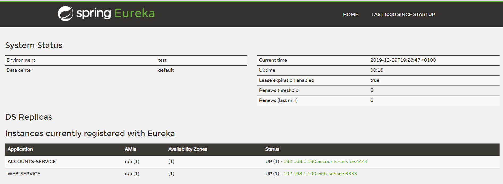
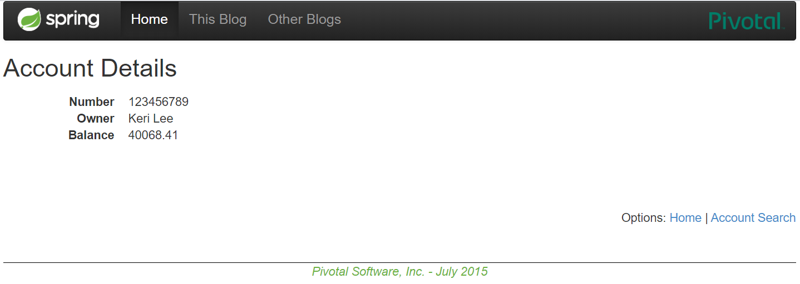

# lab6-microservices

Author: Diego Royo Meneses (740388@unizar.es)

## 1. Eureka Service Registration Server

* The Eureka Service Registration Service is launched. First, it has no microservices registered:



* The service is running on port 1111:



## 2. Registering accounts and web microservices

* Both microservices are launched and automatically connect to the Eureka Registration Service

### Accounts microservice



* Eureka logs:

```
2019-12-29 19:17:36.446  INFO 2178 --- [nio-1111-exec-1] c.n.e.registry.AbstractInstanceRegistry  : Registered instance ACCOUNTS-SERVICE/192.168.
1.190:accounts-service:2222 with status UP (replication=false)
```



### Web microservice



* Eureka logs:

```
2019-12-29 19:19:51.561  INFO 2178 --- [nio-1111-exec-6] c.n.e.registry.AbstractInstanceRegistry  : Registered instance WEB-SERVICE/192.168.1.190
:web-service:3333 with status UP (replication=false)
```


## 3. Launch a second accounts microservice on port 4444

By editing the file in `accounts/application.yml` we can change the port to 4444.

* After this, a second instance of the accounts microservice is launched:



* Eureka logs:

```
2019-12-29 19:24:05.965  INFO 2178 --- [nio-1111-exec-6] c.n.e.registry.AbstractInstanceRegistry  : Registered instance ACCOUNTS-SERVICE/192.168.
1.190:accounts-service:4444 with status UP (replication=false)
```



## 4. Killing the accounts service on port 2222

* After killing the mentioned service, it's marked as "down" and then cancelled on the Eureka Registration Service:

```
2019-12-29 19:28:16.560  INFO 2178 --- [nio-1111-exec-7] c.n.e.registry.AbstractInstanceRegistry  : Registered instance ACCOUNTS-SERVICE/192.168.
1.190:accounts-service:2222 with status DOWN (replication=false)
(...)
2019-12-29 19:28:19.580  INFO 2178 --- [nio-1111-exec-6] c.n.e.registry.AbstractInstanceRegistry  : Cancelled instance ACCOUNTS-SERVICE/192.168.1
.190:accounts-service:2222 (replication=false)
```

* Account microservice on port 2222 is no longer registered:



Because there's another instance registered on port 4444, the web service can still access the accounts, as they are stored in a replicated database which has not changed (see `accounts/src/main/resources/testdb/data.sql`)

> `http://localhost:3333/accounts/123456789`

